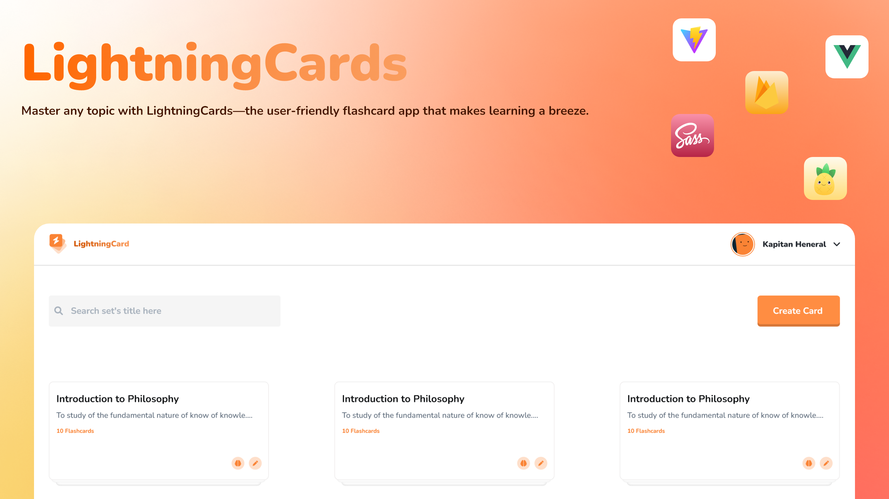

LightningCards  is an open source flashcard app that makes learning easy and fun. Built using modern web technologies like Vite, Pinia, Vue.js (Options API), Sass, and Firebase.

As an open source project, LightningCards is open for all developers to contribute and make it even better. Happy Coding!

# How to install
To install and run **LightningCards**, you will need to have knowledge of how to install npm packages. Follow these steps to get started:

1. Clone the repository onto your local machine using the git clone command followed by the repository link.

2. Navigate to the project directory using the terminal or just open the terminal in the project directory.

3. Run the `npm install` command to install all the required packages and dependencies for the project.
4. Before running `npm run dev`, you'll need to create a Firebase project with authentication and Firestore enabled. Firebase will provide an object containing the configuration details you'll need to use in **LightningCards**. Rename `firebase.config.example`.json to `firebase.config.json` and paste the configuration details into the appropriate fields.
5. After completing all the above steps, you can now use the `npm run dev` command to start the development server and launch the project in your browser.

You should now be able to use **LightningCards** on your local machine.
